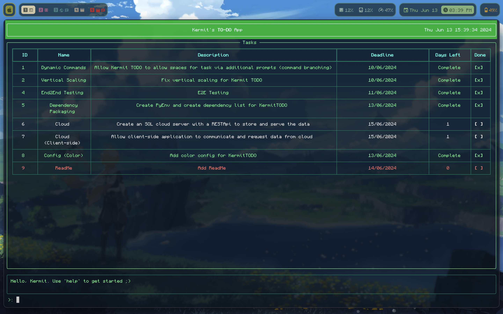
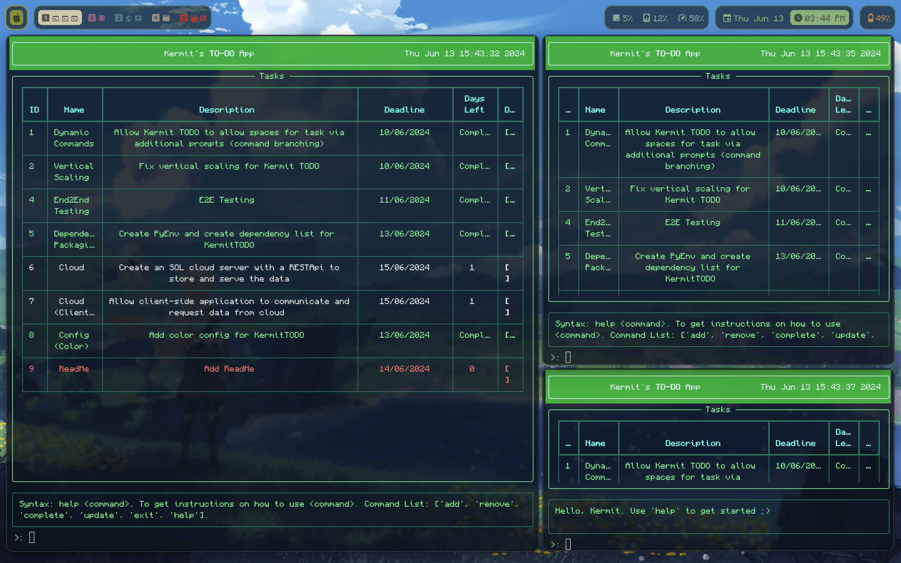
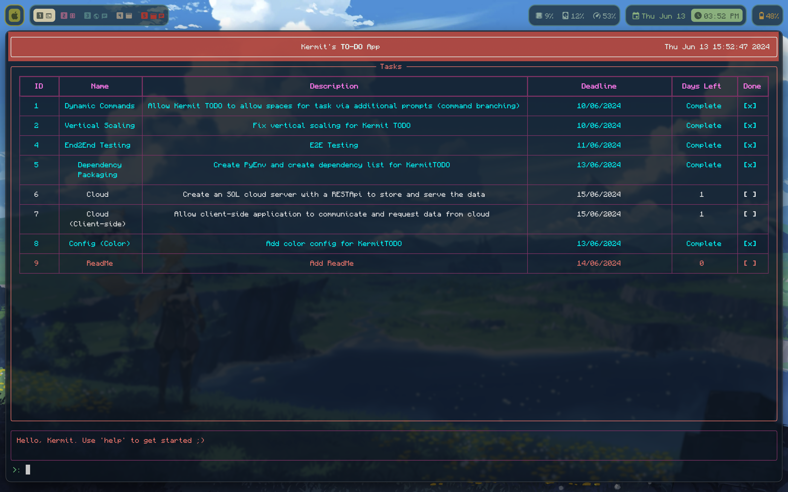

# KermiTODO

**A customisable lightweight CLI to-do application powered only with Python and Rich.**



---
## Features
***Completely Scalable TUI***


***Customisable Color Schemes***


***UPCOMING FEATURES***
- Cloud storage and syncing.
- Allow multiple pages / category of tasks.
- *ANYTHING* else you can suggest.

---
## Run-From-Source Manual:
This section will explain how to run the application directly from the source code using your own installation of Python. (If you simply want an executable, look at the Executable Manual section below.)

#### Step-by-step Python Setup:
- Clone the entire directory into your desired location
- Create or activate a python environment (Conda, Pyenv, or Global) in the directory
- Install all dependencies using ```pip install -r ./requirements.txt``` (Currently only Rich)
- Run ```python main.py``` and enjoy :)

---
## Executable Manual:
This section will explain how to run the application directly from a binary executable without a local installation of python and its dependencies. (If you don't trust binaries, which is very understandable, and want to run from source, look at the Run-From-Source section above)

#### Step-by-step Setup:
- Download the zipped file from releases
- Unzip the directory
- Run the executable and enjoy :)

